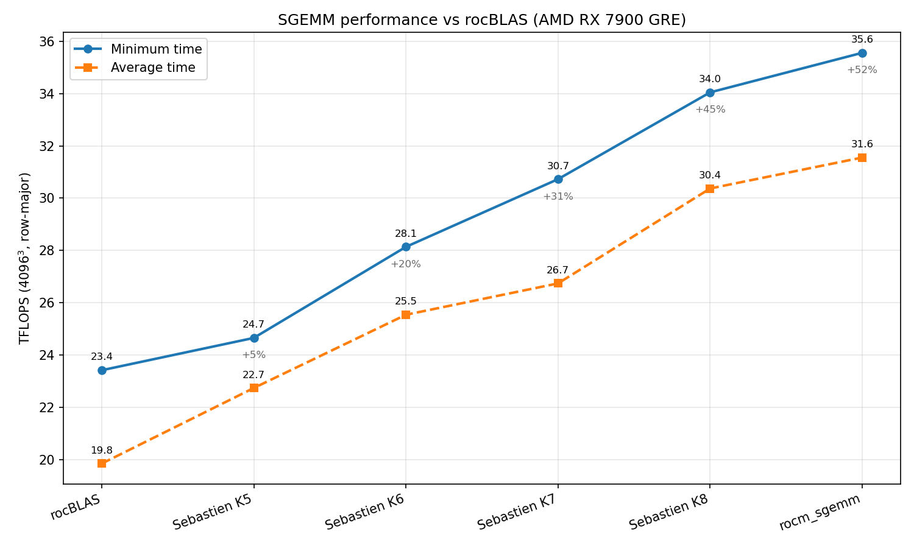
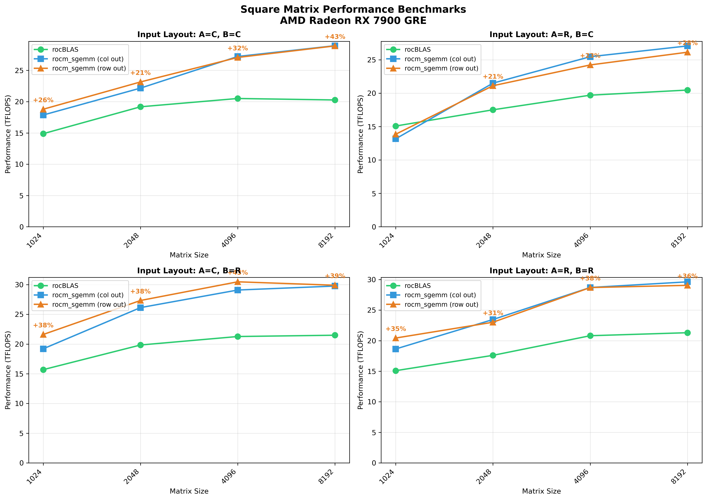
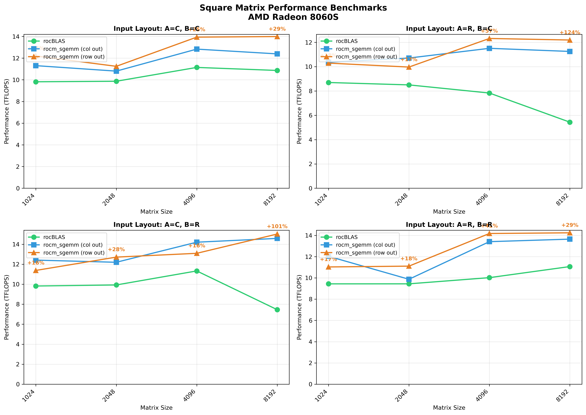

# ROCm SGEMM

This repository provides a standalone, high-performance General Matrix Multiplication (GEMM) implementation optimized for AMD GPUs for single-precision floating-point operations (SGEMM).

Take note that the library isn't fully tuned, and has been only tuned for some sizes (if you pass inputs that are calculated as close to the tuned sizes, the right configuration will be selected). The current workflow of this library is to tune for the specific sizes of your use-case before building. This may be improved upon in the future if time permits.

## Purpose
This repository aims to:
- Provide a focused, high-performance GEMM kernel for single-precision floating-point operations (SGEMM).
- Explore and implement support for various matrix data layouts (e.g., row-major, column-major, potentially tiled formats).
- Provide a benchmarking executable that shows the average, maximum and minimum time for a kernel run, along with the average TFLOPs
- Tune the GEMM kernel for different M, N, K sizes

## Overview

This implementation was inspired by several key sources and observations:

* **Previous WMMA work**: Building on experience from a GEMM implementation of mine [rocm_wmma_gemm](https://github.com/adelj88/rocm_wmma_gemm) that leveraged WMMA instructions and focused on FP16, while achieving good results against rocBLAS
* **Sebastien Vince's research**: Heavily influenced by the excellent article ["Deep Dive into Matrix Optimization on AMD GPUs"](https://seb-v.github.io/optimization/update/2025/01/20/Fast-GPU-Matrix-multiplication.html) where he achieved impressive SGEMM performance through hand-tuned ISA optimizations for 4096×4096×4096 row-major matrices on a 7900 XTX

### Performance Analysis

Testing all implementations on the same hardware (AMD RX 7900 GRE, gfx1100) following Sebastien's benchmarking methodology (which involves identity matrix-multiplication) for direct comparison (all matrices are row-major). Each measurement is the minimum/average of 300 back-to-back runs to reach thermal steady state and suppress clock-boost noise:



| Implementation | Description | Minimum Time (ms) | Performance (TFLOPS) | vs rocBLAS |
|----------------|-------------|-----------|---------------------|-------------|
| rocBLAS | Baseline | 5.87 | 23.4 | 100.0% |
| Sebastien K5 | LDS Optimization (HIP C++) | 5.58 | 24.7 | 105.3% |
| Sebastien K6 | VALU Optimization (ISA) | 4.89 | 28.1 | 120.1% |
| Sebastien K7 | Loop Unrolling (ISA) | 4.47 | 30.7 | 131.2% |
| Sebastien K8 | Batched GMem loads (ISA) | 4.04 | 34.0 | 145.4% |
| **rocm_sgemm** | **HIP C++ Optimized** | **3.87** | **35.6** | **151.8%** |

*Note that average execution times typically provide more realistic performance indicators for practical applications.*

Below are the average execution times by modifying Sebastien's benchmarking methodology:

| Implementation | Description | Average Time (ms) | Performance (TFLOPS) | vs rocBLAS |
|----------------|-------------|-----------|---------------------|-------------|
| rocBLAS | Baseline | 6.93 | 19.8 | 100.0% |
| Sebastien K5 | LDS Optimization (HIP C++) | 6.05 | 22.7 | 114.6% |
| Sebastien K6 | VALU Optimization (ISA) | 5.38 | 25.5 | 128.7% |
| Sebastien K7 | Loop Unrolling (ISA) | 5.14 | 26.7 | 134.7% |
| Sebastien K8 | Batched GMem loads (ISA) | 4.53 | 30.4 | 153.0% |
| **rocm_sgemm** | **HIP C++ Optimized** | **4.36** | **31.6** | **159.0%** |

**Key Finding**: `rocm_sgemm` now outperforms even Sebastien's hand-tuned ISA Kernel 8, proving that the perceived "HIP C++ limitation" can be overcome with the right optimization techniques, while maintaining portability across GPU architectures.

While Sebastien noted that his performance gains "would not have been possible using only HIP C++," `rocm_sgemm` demonstrates that there's still significant optimization potential within the HIP C++ framework. By carefully applying advanced optimization techniques, it's possible to achieve competitive performance while preserving portability and maintainability across different GPU architectures.

Below is a comparison against rocBLAS for different layout permutations and using regular matrix-multiplication (different input values).

**Square Matrix Performance by Layout:**





## Building the Project

### Prerequisites
- AMD ROCm installed with HIP support
- CMake version 3.10 or higher
- Python3 (required for config generation, tuning and docs/report generation)
  - Python packages (can be installed with pip or conda)
    - ``numpy`` (required for tuning and docs/report generation)
    - ``scikit-learn`` (required for tuning)
    - ``matplotlib`` (required for docs/report generation)
- AMD RDNA GPU (code needs to be modified to support CDNA GPUs)

### Build Steps
1. Clone the repository:
   ```bash
   git clone https://github.com/adelj88/rocm_sgemm.git
   cd rocm_sgemm
   ```
2. Build:
   ```bash
   mkdir build
   cd build
   CXX=/opt/rocm/bin/hipcc cmake ..
   make
   ```

### Usage
```bash
# Assumes you're currently in /build directory

# Unit tests
./test/test_float

# Benchmarks (pass custom sizes with --shapes, e.g. M,N,K or square M)
./benchmark/bench_float
./benchmark/bench_float --shapes 4096,4096,2048:4096,5120,5120

# rocBLAS comparison for verification
./test/test_rocblas
./benchmark/bench_rocblas
```

### Automatic Kernel Tuning
Finding the absolute best kernel configuration (warps, warp/thread tiles, threads-per-row, block-k, buffering, swizzle, etc.) is tricky. GPU tuning is highly intertwined — changing one parameter often means you have to adjust another for it to stay fast, and running thousands of kernels to see what works best is slow.

To solve this, `tune.py` uses a **population-free estimation-of-distribution search**. It learns purely from measured benchmark times with no hand-coded performance model: there is no population or working set whose size must be chosen, and the (huge) valid configuration space is never enumerated — candidates are sampled with rejection, so cost scales only with the benchmark budget.

#### **How it works**
Each step rebuilds everything from the archive of benchmarked configs:

- **Soft weighting**: every config gets a scale-invariant weight `w = (t_min / t)^beta`, so faster configs carry more statistical leverage while slow ones still inform the model.
- **Linkage estimation from data**: bias-corrected, symmetric-uncertainty-normalized mutual information reveals which parameters are coupled, and they are greedily agglomerated into blocks.
- **Factored generative model**: `P(x)` is a product of Dirichlet-smoothed weighted joints over those blocks — sampling it respects the learned couplings while still allowing novel-but-plausible combinations.
- **Expected-Improvement acquisition**: candidates drawn from the model (plus random immigrants) are scored by a random-forest surrogate fit on the whole archive; the argmax EI is the next config benchmarked.
- **Reproducible results**: one seeded RNG per (size, layout) plus a fixed-seed surrogate makes runs deterministic.

#### **Config file naming**
Tuned configs are stored per-arch as `gemm_config_<arch>.json` (e.g. `gemm_config_gfx1100.json`). Place these files in `rocm_sgemm/config/` before building.

#### **Running the Tuner**
```bash
cd build

# Tune all default sizes and layouts (output: gemm_config_<arch>.json)
python3 tune.py --gpu-arch gfx1100

# Test specific sizes
python3 tune.py --sizes 1024,1024,1024 2048,2048,2048

# Adjust evaluation budget per layout
python3 tune.py --budget 100

# Test specific layouts (e.g., row,col,row and col,col,col)
python3 tune.py --layouts r,c,r c,c,c

# Reproducible results with specific seed
python3 tune.py --seed 123

# Different GPU architecture
python3 tune.py --gpu-arch gfx1103

# Resume tuning using an existing config as a baseline
python3 tune.py --input gemm_config_gfx1100.json

# Force overwrite existing configs (don't use them as a baseline)
python3 tune.py --input gemm_config_gfx1100.json --overwrite

# Custom output file
python3 tune.py --output my_config.json
```

### Configuration Racing
GPUs are incredibly sensitive to heat. When comparing two configurations back-to-back, thermal throttling can easily make the second one look slower just because the GPU warmed up during the first test.

The `race.py` script exists to solve this by **interleaving evaluations**. By bouncing back and forth between two configurations, it handles hardware noise and temperature fluctuations fairly, ensuring that the fastest configuration actually wins.

#### **Racing Modes**
- **File vs File Racing**: Compares two configuration files head-to-head and spits out a new merged file containing only the absolute best performers.
- **Cross-Layout Sanity Check**: For a specific matrix size and layout, it checks whether your row-major-C configuration is *actually* faster than your column-major-C one by testing both on both layouts.

#### **Running the Racer**
```bash
cd build

# Race two config files (saves the best to gemm_config_raced.json)
python3 race.py --config1 gemm_config_gfx1100.json --config2 other_config.json

# Run a cross-layout sanity check
python3 race.py --config1 gemm_config_gfx1100.json --cross-check

# Adjust the number of benchmark rounds to combat noise (default: 5)
python3 race.py --config1 config1.json --config2 config2.json --repeats 10

# Custom output file
python3 race.py --config1 config1.json --config2 config2.json --output winner.json
```

## Performance Results
Below are benchmark results (in TFLOPs) that compares `rocm_sgemm` against `rocblas` for all layouts and different sizes.

- [View detailed gfx1100 square matrix benchmarks](docs/gfx1100_square.md)
- [View detailed gfx1151 square matrix benchmarks](docs/gfx1151_square.md)

## Future Plans
1. Further tuning to get better performance
2. Explore any possibility of further optimizations

## License

This project is licensed under the MIT License - see the [LICENSE](LICENSE) file for details.
