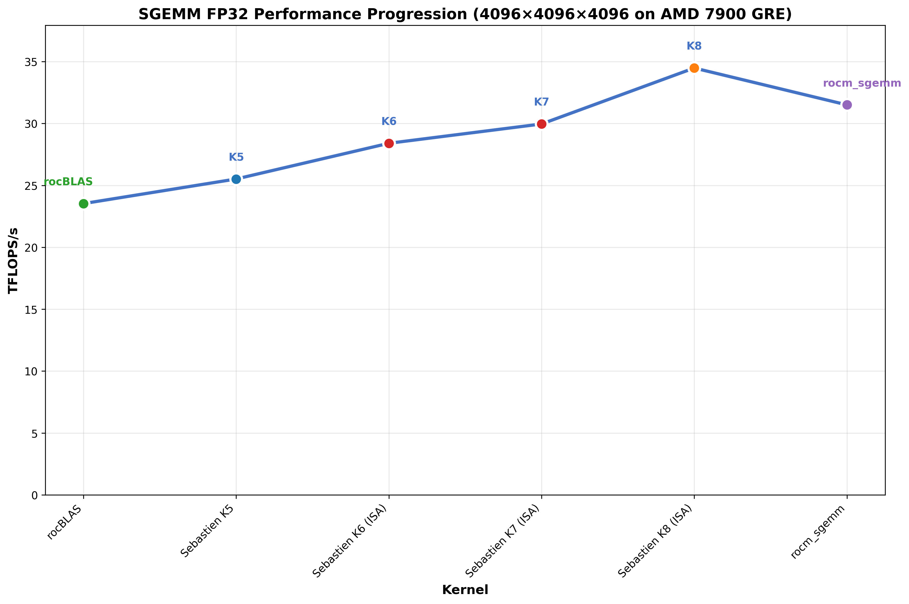

# ROCm SGEMM

This repository provides a standalone, high-performance General Matrix Multiplication (GEMM) implementation optimized for AMD GPUs for single-precision floating-point operations (SGEMM).

Take note that the library isn't fully tuned, and has been only tuned for some sizes (if you pass inputs that are calculated as close to the tuned sizes, the right configuration will be selected). The current workflow of this library is to tune for the specific sizes of your use-case before building. This may be improved upon in the future if time permits.

## Purpose
This repository aims to:
- Provide a focused, high-performance GEMM kernel for single-precision floating-point operations (SGEMM).
- Explore and implement support for various matrix data layouts (e.g., row-major, column-major, potentially tiled formats).
- Provide a benchmarking executable that shows the average, maximum and minimum time for a kernel run, along with the average TFLOPs
- Tune the GEMM kernel for different M, N, K sizes

## Overview

This implementation was inspired by several key sources and observations:

* **Previous WMMA work**: Building on experience from a GEMM implementation of mine [rocm_wmma_gemm](https://github.com/adelj88/rocm_wmma_gemm) that leveraged WMMA instructions and focused on FP16, while achieving good results against rocBLAS
* **Sebastien Vince's research**: Heavily influenced by the excellent article ["Deep Dive into Matrix Optimization on AMD GPUs"](https://seb-v.github.io/optimization/update/2025/01/20/Fast-GPU-Matrix-multiplication.html) where he achieved impressive SGEMM performance through hand-tuned ISA optimizations for 4096×4096×4096 row-major matrices on a 7900 XTX

### Performance Analysis

Testing all implementations on the same hardware (AMD 7900 GRE) using minimum execution times following Sebastien's benchmarking methodology (which involves identity matrix-multiplication) for direct comparison (all matrices are row-major):



| Implementation | Description | Minimum Time (ms) | Performance (TFLOPS) | vs rocBLAS |
|----------------|-------------|-----------|---------------------|-------------|
| rocBLAS | Baseline | 5.88 | 23.4 | 100.0% |
| Sebastien K5 | LDS Optimization (HIP C++) | 5.49 | 25.0 | 106.8% |
| Sebastien K6 | VALU Optimization (ISA) | 4.79 | 28.7 | 122.6% |
| Sebastien K7 | Loop Unrolling (ISA) | 4.58 | 30.0 | 128.2% |
| Sebastien K8 | Batched GMem loads (ISA) | 4.02 | 34.2 | 146.2% |
| **rocm_sgemm** | **HIP C++ Optimized** | **4.55** | **30.2** | **129.1%** |

*Note that average execution times typically provide more realistic performance indicators for practical applications.*

Below are the average execution times by modifying Sebastien's benchmarking methodology:

| Implementation | Description | Average Time (ms) | Performance (TFLOPS) | vs rocBLAS |
|----------------|-------------|-----------|---------------------|-------------|
| rocBLAS | Baseline | 6.28 | 21.9 | 100.0% |
| Sebastien K5 | LDS Optimization (HIP C++) | 5.96 | 23.1 | 105.5% |
| Sebastien K6 | VALU Optimization (ISA) | 5.37 | 25.6 | 117.1% |
| Sebastien K7 | Loop Unrolling (ISA) | 5.03 | 27.3 | 124.8% |
| Sebastien K8 | Batched GMem loads (ISA) | 4.46 | 30.8 | 140.8% |
| **rocm_sgemm** | **HIP C++ Optimized** | **4.80** | **28.6** | **130.8%** |

**Key Finding**: `rocm_sgemm` matches Sebastien's hand-tuned ISA Kernel 7 performance, proving that the perceived "HIP C++ limitation" can be overcome with the right optimization techniques, while maintaining portability across GPU architectures.

While Sebastien noted that his performance gains "would not have been possible using only HIP C++," `rocm_sgemm` demonstrates that there's still significant optimization potential within the HIP C++ framework. By carefully applying advanced optimization techniques, it's possible to achieve competitive performance while preserving portability and maintainability across different GPU architectures.

Below is a comparison against rocBLAS for different layout permutations and using regular matrix-multiplication (different input values).

**Square Matrix Performance by Layout:**


## Building the Project

### Prerequisites
- AMD ROCm installed with HIP support
- CMake version 3.10 or higher
- Python3 (required for config generation and tuning)
  - Python packages (can be installed with pip or conda)
    - ``numpy``
    - ``optuna``
- AMD RDNA GPU (code needs to be modified to support CDNA GPUs)

### Build Steps
1. Clone the repository:
   ```bash
   git https://github.com/adelj88/rocm_sgemm.git
   cd rocm_sgemm
   ```
2. Build:
   ```bash
   mkdir build
   cd build
   CXX=/opt/rocm/bin/hipcc cmake ..
   make
   ```

### Usage
Run the executable after building:
```bash
# Assumes you're currently in /build directory
# To run unit tests
./test/gemm_test

# To run unit benchmarks
./benchmark/gemm_bench

# To run rocblas equivalent for verification
./test/rocblas_test
./benchmark/rocblas_bench
```

### Automatic Kernel Tuning
The library includes an Optuna-based Tree-structured Parzen Estimator (TPE) tuner that automatically finds optimal kernel configurations for different matrix sizes and data layouts.

#### **Tuning Approach**
The tuner uses **Optuna TPE (Tree-structured Parzen Estimators)** to efficiently explore the discrete parameter space:

- **TPE optimization**: Models the performance landscape using probabilistic distributions to intelligently sample promising regions
- **Smart initialization**: Tests proven baseline configurations first to seed the optimization with known good solutions
- **Multivariate learning**: Understands relationships between parameters (e.g., block sizes and tile configurations)
- **Adaptive sampling**: Balances exploration of uncertain regions with exploitation of high-performing areas
- **Reproducible results**: Uses configurable random seeds for consistent and repeatable tuning runs

To run the tuner:
```bash
cd build

# Default behavior (all sizes and layouts)
python3 tune.py # Results written to gemm_config_tuned.json

# Test specific sizes
python3 tune.py --sizes 1024,1024,1024 2048,2048,2048

# Adjust evaluation budget
python3 tune.py --budget 100

# Test specific layouts
python3 tune.py --layouts r,c,r c,c,c

# Reproducible results with specific seed
python3 tune.py --seed 123

# Different GPU architecture
python3 tune.py --gpu-arch gfx1103

# Custom output file
python3 tune.py --output my_config.json

# Custom baseline configurations
python3 tune.py --baselines 128,128,128,8,4,4,2,4,8 256,128,128,8,2,2,4,4,4
```

## Performance Results
Below are benchmark results (in TFLOPs) that compares `rocm_wmma_gemm` against `rocblas` for all layouts and different sizes.

- [View detailed square matrix benchmarks](docs/square.md)

## Future Plans
1. Address lower performance for column-major output
   - A separate tuning profile is probably necessary, given that the current tuning script focuses on row-major outputs
2. Further tuning to get better performance
3. Explore any possibility of further optimizations

## License

This project is licensed under the MIT License - see the [LICENSE](LICENSE) file for details.
